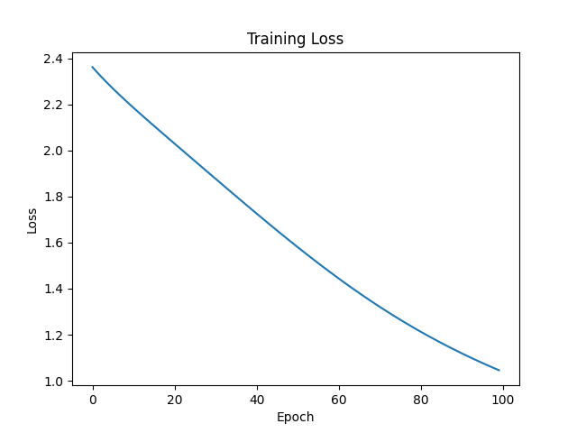
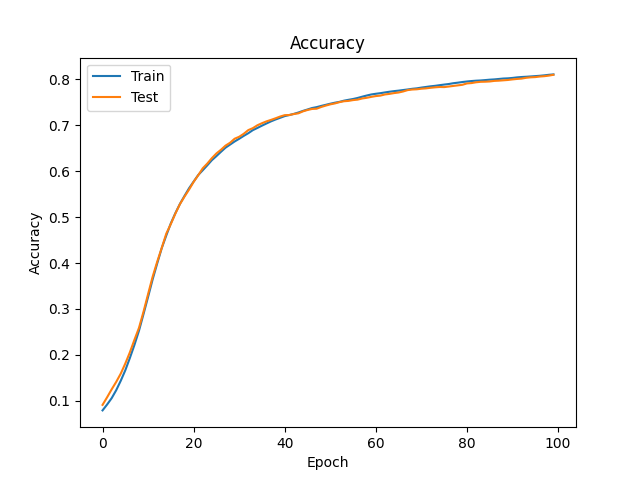

# Neural Network From Scratch (NumPy Only)

## Overview

This project implements a fully connected neural network from scratch using only NumPy.  
No deep learning frameworks (PyTorch, TensorFlow, etc.) were used.

The goal was to manually implement forward propagation, backpropagation, and gradient descent to understand the mechanics of neural networks.

The model is trained on the MNIST handwritten digit classification dataset.

---

## Architecture

Input Layer: 784 neurons (28×28 flattened image)  
Hidden Layer: 256 neurons (ReLU activation)  
Output Layer: 10 neurons (Softmax activation)  

784 → 256 → 10

---

## Forward Pass

Z1 = XW1 + b1  
A1 = ReLU(Z1)  
Z2 = A1W2 + b2  
A2 = Softmax(Z2)

Softmax uses a numerical stability adjustment.

---

## Loss Function

Cross-Entropy Loss:

L = - Σ y log(ŷ)

---

## Backpropagation

Output layer gradient:

dZ2 = A2 - y  

Hidden layer gradient:

dZ1 = (dZ2 W2ᵀ) ⊙ ReLU'(Z1)

Weights are updated using full-batch gradient descent.

---

## Training Details

Dataset size: 20,000 samples  
Train/Test split: 80/20  
Learning rate: 0.3  
Epochs: 100  
Optimizer: Full-batch Gradient Descent  

---

## Results

Final Train Accuracy: ~80%  
Final Test Accuracy: ~79–80%

### Training Loss

### Accuracy

---

## Key Takeaways

- Implemented backpropagation manually.
- Verified gradient flow and convergence.
- Explored learning rate effects.
- Observed generalization gap between train and test sets.

---

## Requirements

pip install -r requirements.txt

Dependencies:
- numpy
- scikit-learn
- matplotlib
